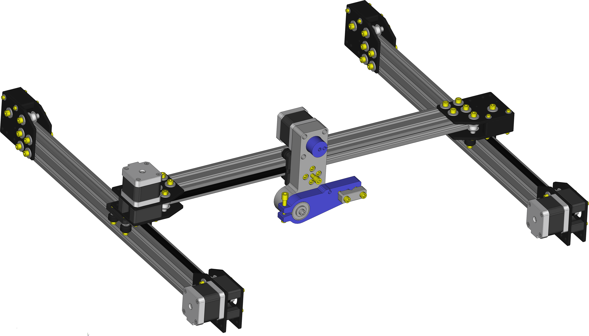
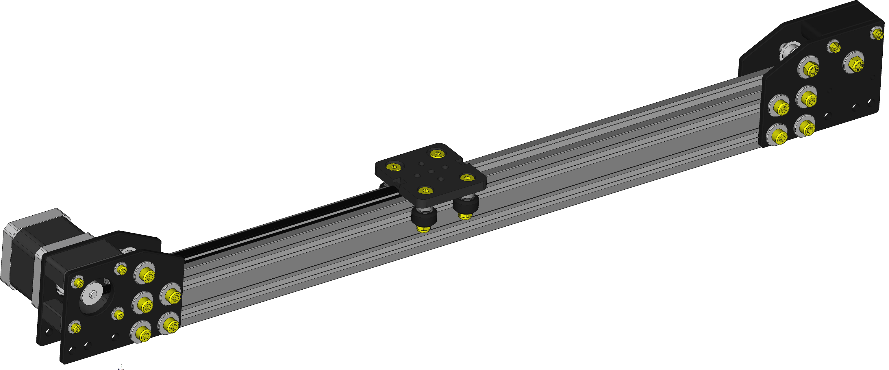
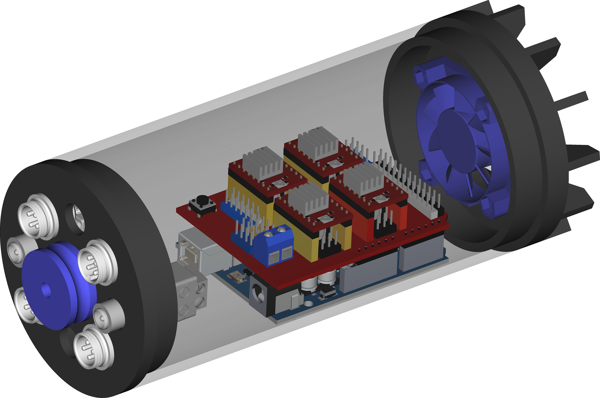

# **XY-Plot**

A plotter is a printer designed for printing vector graphics. Instead of printing individual dots on the paper, plotters draw continuous lines.
This makes plotters ideal for printing architectural blueprints, engineering designs, and other CAD drawings. 



## **XY-Plot hardware requirements**

The main components are:

>-  1x Arduino Uno R3 board or Mega 2560 R3;
>-  1x CNC Shield V3 expansion board;
>-  4x DRV8825 stepper motor driver;
>-  4x Stepper motor Nema-17 (min torque 40 Ncm);
>-  3x Timing belt pulley GT2 20T 5mmn bore;
>- 12x Smooth idler pulley with bearings GT2 20T 5mm bore;
>- 10m GT2 timming belt;
>-  1x 12V/5A power supplier;
>-  1x 3D-Printer for printing all hardware parts;
>-  40x40 beams, carriages. See [OpenBuilds parts store](https://openbuildspartstore.com/);
>-  Washers, bolts and nuts.

### **X Linear Actuator**
Prints parts and assembly two X axis linear actuator.



### **Y Linear Actuator & Pen Holder**
Prints parts, assembly one Y axis linear actuator and pen holder.


## **XY-Plot software requirements**

For compiling XY-Plot Client use [Lazarus IDE and FreePascal compiler](https://www.lazarus-ide.org/index.php?page=downloads).

**Libraries**:

>- [BGRA Controls Library](https://bgrabitmap.github.io/)
>- [LNet Library](https://lnet.wordpress.com/)

Use integrated [Online Package Manager](https://wiki.freepascal.org/Online_Package_Manager ) for installing all libraries.

**Build Client**:

```console
lazbuild --build-mode=Release xyplot.lpi
lazbuild --build-mode=Debug xyplot.lpi
```

**Build Server**:

For building and loading server sketch on Arduino board use [Arduino IDE](https://www.arduino.cc/en/Main/Software).

## **Before assembling**

Set the Vref current on DRV8825 stepper drivers. See the guide

>- [How to control a stepper motor with DRV8825](https://www.makerguides.com/drv8825-stepper-motor-driver-arduino-tutorial/)

## **Connecting to Arduino**

Nema 17 motors have 200 steps for rotation but by enabling microsteps on the Pololu drivers we can obtain up to 3200 steps for rotation which allows for much more precision. For doing that add four jumpers on green pins. 


**Then**
- Mount the stepper drivers on CNC schield board;
- Apply two jumpers on green pins for clonig X axis;
- Connect X motors to the blue pins;
- Connect Y motor to red pins;
- Connect Z motor to yellow pins.


- Mount CNC Shield on arduino board;
- Connect Arduino board to PC by usb port;
- Connect 12V power supply to CNC schield.

## **Starting**

Open XY-Plot client for connecting and controlling Plotter.


## **Boards Box**

Below a boards box example.



## **LICENSE**
[GNU General Public License v3.0](LICENSE)
